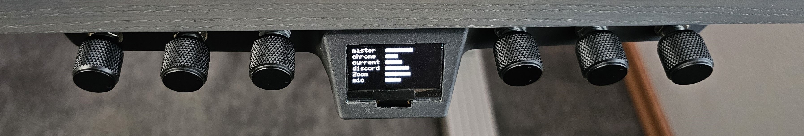
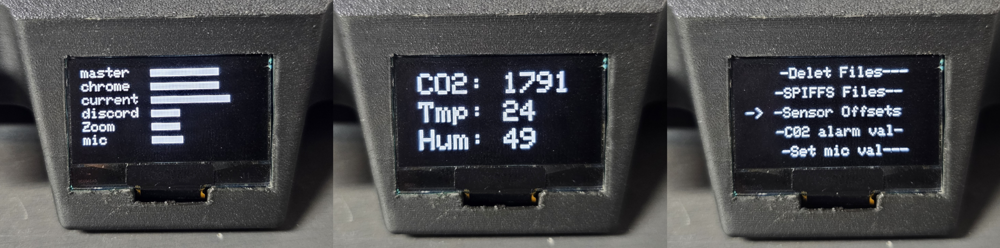
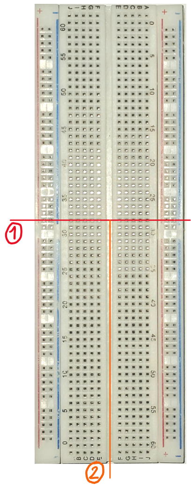
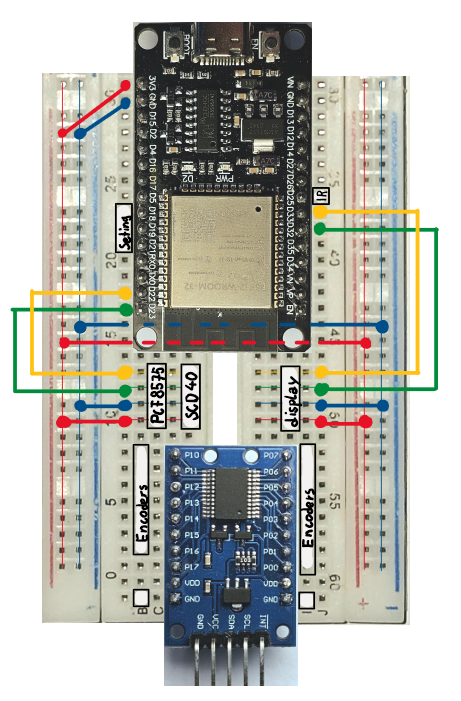
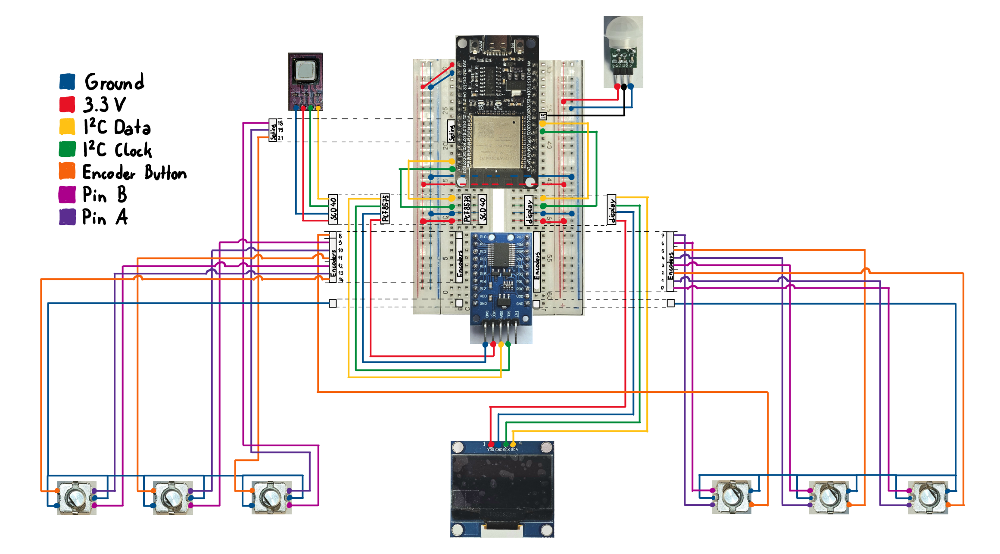

# another_deej_controller

This project features an under-the-desk-style volume mixer with six rotary encoders for controlling individual audio channels on your PC, a display for visual feedback, and an air quality sensor that I had lying around.

For those who don’t know what Deej is: 
Deej is an open-source project by omriharel that enables users to control individual application audio levels on your PC using a DIY Volume Mixer.

My project focuses on building a volume mixer with additional advanced features. For the mixer to function, the PC still needs to be running the Deej software, which you can get from omriharel's [deej project github page](https://github.com/omriharel/deej)

The primary aim of this project was to learn and gain hands-on experience, so I decided to incorporate some non-essential features, which added complexity. If you're looking to build a more basic volume mixer, I highly recommend following the instructions provided by the original Deej project.

# Overview

## How to use

While the mixer controls six volume levels, the channels are not mapped one-to-one with the rotary encoders. I found that I only need fine control over five audio channels: Master, Chrome, Current, Discord, and Zoom.

For my microphone, I prefer it either completely muted or set to its default volume (roughly 43%). Because of this, Encoder 4 is dedicated to controlling device settings, and the microphone volume is instead managed with the buttons on Encoders 5 and 6.

Here’s an overview of what each encoder does on the home screen (encoders numbered from left to right):

| Encoder # | Label        | Rotation       | Short Press          | Long Press                                                                        | Hold                                                                  |
| --------- | ------------ | -------------- | -------------------- | --------------------------------------------------------------------------------- | ----------------------------------------------------------------------|
| 1         | MasterVolume | Volume up/down | Mute/Unmute          | Save current volume levels                                                        | -                                                                     |
| 2         | Chrome       | Volume up/down | Mute/Unmute          | Turn screen off (screen will turn back on when any encoder is rotated or pressed) | -                                                                     |
| 3         | Current      | Volume up/down | Mute/Unmute          | -                                                                                 | -                                                                     |
| 4         | Menu Encoder | Enter settings | Show air quality     | -                                                                                 | -                                                                     |
| 5         | Discord      | Volume up/down | Mute the mic channel | Unmute mic channel                                                                | -                                                                     |
| 6         | Zoom         | Volume up/down | -                    | -                                                                                 | Boost mic channel to 100% (for when you need to win an argument 😉)  |
 
## Other random Features

- **Sleep Mode**: If the IR sensor doesn't detect your presence, the screen will turn off until you return to your desk or move one of the knobs.

- **CO2 Alert**: If the CO2 sensor detects that levels exceed the set threshold (which can be configured in the settings menu), an alert will display on the screen, reminding you to let in some fresh air. You can dismiss the alert by moving any of the knobs, but it will return after 15 minutes if levels remain high.

- **Saving Slider Values**: By long-pressing Encoder 1, the current slider values will be saved to local storage. When the device restarts, these values will be loaded automatically (even after a power loss).

# Build 

I attempted to minimize soldering as much as possible. However, since the pins on the encoders are too small to securely fit standard jumper cables, soldering the cables to the pins is necessary.

## Parts

| Quantity | Part                                                                                           | 
| -------- | ---------------------------------------------------------------------------------------------- |
| 6x       | Rotary encoder with switch, 20 pulses per revolution (EN11-HSM1BF20 or EC11)
| 6x       | Knob for rotary shaft, 6mm (pay attention if your encoders have D-type or star shape shaft)
| 1x       | ESP32 Development Board (preferably with USB-C)
| 1x       | PCF8575 IO Expander I2C (16IO pins)
| 1x       | SCD40 or SCD41 CO₂ Sensor I2C (optional)
| 1x       | AM312 DC 2.7-12V PIR Human Sensor
| 1x       | 1.3-Inch OLED Display I2C (not SPI)
| 1x       | Breadboard (MB-102)
| ?x       | Some jumper cables
| 4x       | M3 screws (no longer than 8mm)
| 1x       | Double-sided tape
| (1x)     | 3D printed case

## Flash ESP32

1. Download the Arduino IDE  https://www.arduino.cc/en/software

2. Pull the Arduino project directory from this repository.

3. On your local system, navigate into the directory and open any of the `.ino` files with the Arduino IDE. The rest of the project files should load automatically 

4. Use the Board Manager to install the ESP32 package by Espressif Systems (version 3.0.5).

5. Use the Library Manager to install the following libraries:
   - **PCF8575** (by Rob Tillart, version 0.2.3)
   - **Sensirion I2C SCD4X** (by Sensirion, version 0.4.0)
   - **Adafruit SH110X** (by Adafruit, version 2.1.11)

6. Select the board under **Tools** -> **Board**.

7. Select the COM port that your ESP32 is connected to.

8. Click the **Upload** button.

    (you might need to hold down the boot button on your ESP23 board during the Upload)

## 3D Printing

The case could still use some optimization to improve printability.

- The main body must be printed with supports, which can be tricky to remove from the cavity in the display section. I had good results using tree supports.
    
    Even with perfect print quality, my design makes it difficult (but not impossible) to maneuver the display into place.

- The lid is printed standing on edge. The model includes some stabilizing fins to prevent it from falling over during printing. Due to the small contact area with the bed, you might also want to use a brim.

If you use Bambu Studio, you can grab the *Case_BambuStudio.3mf* file with all the settings that worked for me. If not, you can use the STEP files. I also included the Autodesk Fusion project if you want to make changes to the model.

## Assembly  

### 1. Cutting the breadboard

The case is too small for a full-sized breadboard to fit, but a half-sized breadboard is too small to accommodate all the components. So, a full-sized breadboard needs to be cut down.

Additionally, the breadboard needs to be split down the middle due to the wide footprint of the ESP32.

### 2. Encoder prep:

I prefer smooth rotary encoders for my volume control, but I found no place to buy them. Luckily, it’s possible to modify a step encoder. (If you choose to modify your encoders, keep one stock as the menu encoder should have steps.)

- **Step 1**: Open the encoder.
- **Step 2**: Locate the spring that pushes on the notches.
- **Step 3**: Rip out the spring.
- **Step 4 (optional)**: Add some thick **NON-CONDUCTIVE** grease (I used silicone grease). The grease will increase resistance during rotation, making the encoder feel smoother.
- **Step 5**: Reassemble the encoder.

### 3. Wiring
    
1. Start by populating the breadboard as shown below:

    (For the connections on the breadboard, use small bent wire.)

    

2. Next, solder the jumper cables to your encoders.
3. Solder the ground wires to the encoders (you should have two sets of three encoders).
4. Now, plug everything together.

    

### 4. Stuff everything into the Case

- Use some double-sided tape to hold the SCD40 sensor in place.

- The display can be quite tricky (sorry):

    Cut off the small part of the connector pins sticking out the front; this will allow the display to sit flush.

    Maneuver the display into place. Depending on your print quality, you might need to clean up the print.

    Once in place, tape or glue it down to ensure it doesn't accidentally get pushed back into the case later.

- Stick down the breadboard with the port of the ESP32 sticking out the back. This will allow you to access the reset and boot buttons.

- Bend over the jumper cables on the breadboard. I wanted to make the case as thin as possible, and if the jumper cables stick straight up, the lid can't be closed. 

- Everything else should be straightforward.

    

